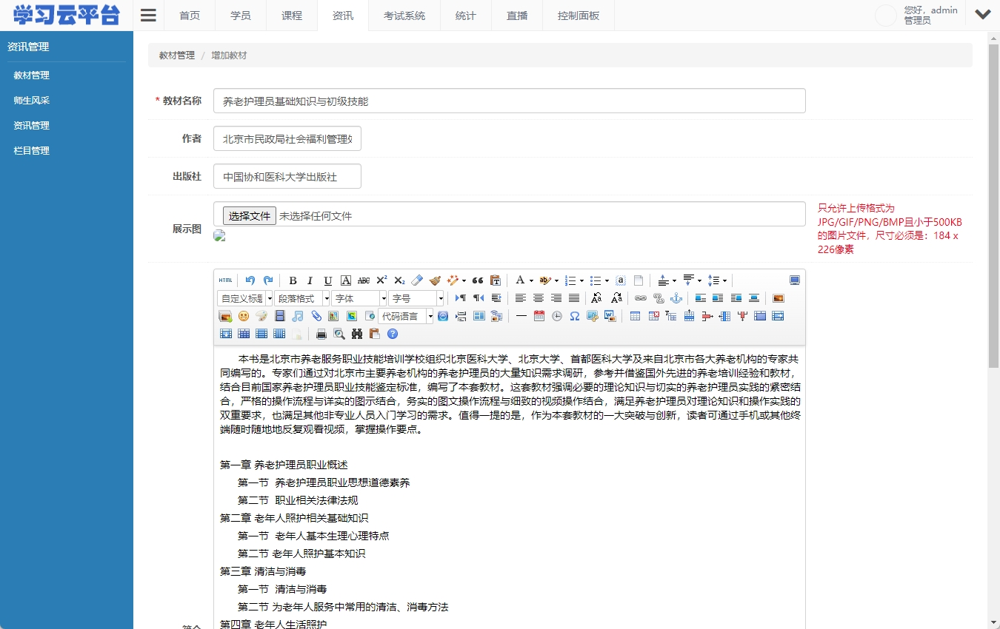

# cloud-edu
在线考试平台 - 在线题库、组卷、在线考试。可根据知识点、教材、难度等自动组卷，学员在线限时完成答卷。

## 主要功能
1. 学员管理
2. 教材管理
3. 教师管理
4. 课程管理（课程类别、课程级别、在线课程）
5. 直播管理
6. 直播历史
7. 知识点、科目、考核类型管理
8. 资讯管理
9. 题库管理（单选、多选、判断）
10. 题库批量导入
11. 组卷策略和组卷管理
12. 统计报表与图表
13. 权限系统（角色与用户）
14. 操作日志

## 界面截图
 系统概览 |  学员管理
---|---

 课程管理 |  统计页
---|---

 统计页 |  在线直播管理
---|---

 自动组卷 |  题库管理
---|---

 知识点管理 |  教材管理
---|---

 资讯管理 |  考试列表页
---|---

 考试页面 |  考试页面的试题列表
---|---

## 联系我
如果您有任何需要或者疑问，请联系我：QQ(81224865), 邮箱：tiger.hu.liu@gmail.com

